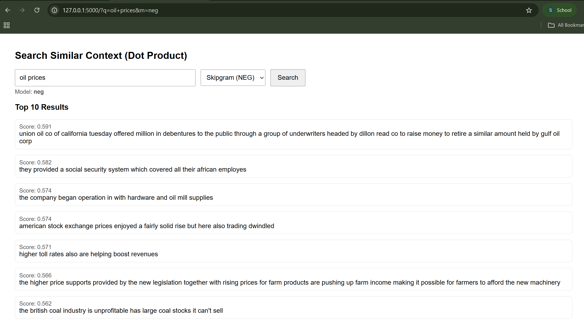

# NLP Context Search Engine

This project is a simple **search engine web application** built using **word embeddings** trained on the Brown news corpus.  
It retrieves the **top 10 most similar contexts** for a given query using **dot product similarity**.

The application supports multiple embedding models:
- Skipgram
- Skipgram with Negative Sampling
- GloVe

---

## How to Run the App

1. Install dependencies:
```bash
pip install torch flask nltk gensim scipy pandas

cd code
python app.py

http://127.0.0.1:5000


---


