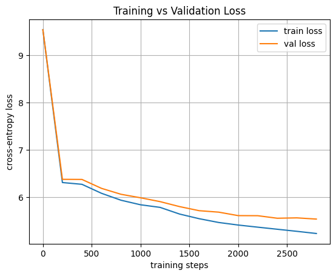
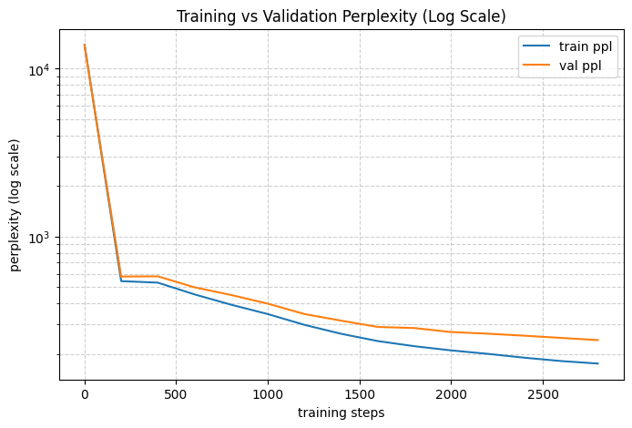

# A2 – LSTM Language Model (Natural Language Processing)

This project implements a **word-level LSTM Language Model** trained on classic literary texts from **Project Gutenberg**.  
The assignment covers data preprocessing, model training, evaluation using loss and perplexity, and deployment using a **Flask web application**.

---

## 📚 Dataset Used (Project Gutenberg)

The model is trained using the following public-domain books from **Project Gutenberg**:

- **Book ID #11** – *Alice’s Adventures in Wonderland*
- **Book ID #1342** – *Pride and Prejudice*
- **Book ID #84** – *Frankenstein*
- **Book ID #1661** – *The Adventures of Sherlock Holmes*

All texts were cleaned, tokenized, and combined into a single training corpus.

---


## 📊 Training Results

### Loss Curve
The plot below shows the **training and validation loss** during model training:



### Perplexity Curve
Perplexity is used as the primary evaluation metric for the language model:



Lower perplexity indicates better language modeling performance.

---


## 🚀 How to Run the Project

### 1️⃣ Train the Model
Open and run the notebook:

```bash
a2.ipynb

## 🚀 Run the Flask Web Application

After training is complete, navigate to the `code` directory and run:

```bash
cd A2/code
python app.py

Then open your browser and visit:

http://127.0.0.1:5000
```
--- 

## Demo


