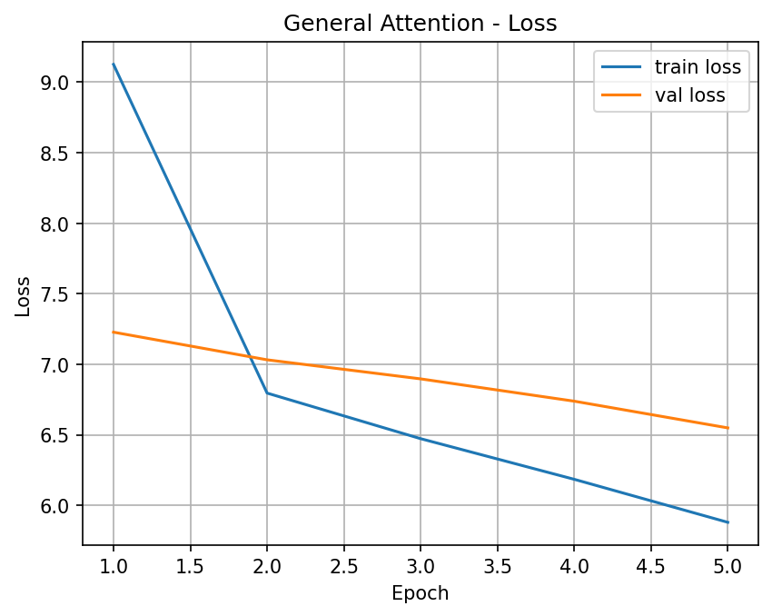
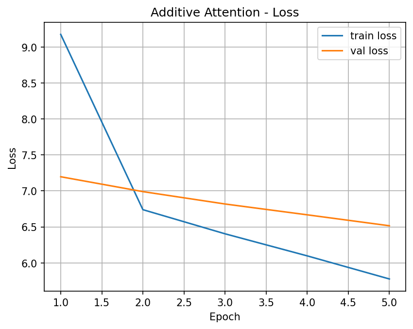
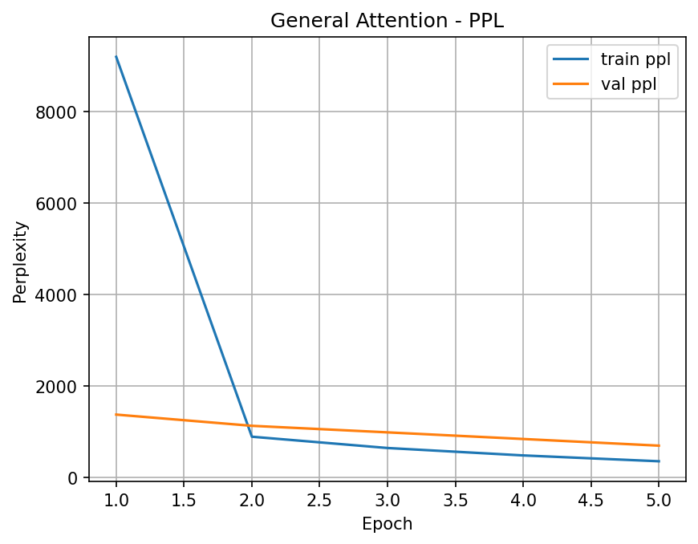
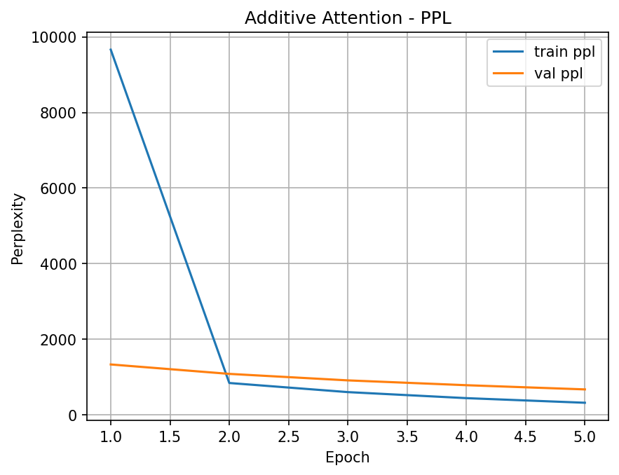

# A3 – English → Nepali Neural Machine Translation with Attention


This project implements a **Neural Machine Translation (NMT)** system that translates **English → Nepali** using a **Seq2Seq architecture with attention mechanisms**.
The workflow covers **dataset preparation, tokenization, model training, evaluation, comparison of attention types, inference, and web deployment**.

---

##  Features

* English → Nepali translation using **attention-based Seq2Seq**
* Comparison of **General vs Additive Attention**
* Training **loss & perplexity tracking**
* **Loss curve visualization**
* **Model saving and inference pipeline**
* Simple **Flask web app** for real-time translation

---

##  Dataset

**Dataset:** `Helsinki-NLP/opus-100 (en-ne)`
**Source:** Hugging Face Datasets

Why this dataset:

* Clean **parallel bilingual sentences**
* Suitable for **low-resource translation research**
* Standard benchmark for **English–Nepali NMT**

---

##  Tokenizer

**Model:** `facebook/nllb-200-distilled-600M`
**Tokenizer:** `NllbTokenizerFast`

Provides:

* Multilingual vocabulary
* Proper handling of **Nepali script**
* Special tokens:

  * `pad_token_id`
  * `eos_token_id`
  * `forced_bos_token_id`

---

##  Model Architecture

### Encoder

* Embedding layer
* Recurrent sequence model (GRU/LSTM-style)

### Attention Mechanisms Compared

* **General Attention**
* **Additive Attention**

### Decoder

* Attention-aware recurrent decoding
* Linear projection → vocabulary probabilities

---

##  Training Setup

| Parameter     | Value         |
| ------------- | ------------- |
| Loss          | Cross-Entropy |
| Optimizer     | Adam          |
| Learning Rate | 3e-4          |
| Epochs        | 5             |

Metrics tracked:

* Training loss
* Validation loss
* Perplexity

---

##  Results

| Attention          | Training Loss | Training PPL | Validation Loss | Validation PPL |
| ------------------ | ------------- | ------------ | --------------- | -------------- |
| General Attention  | 5.8801        | 357.85       | 6.5493          | 698.77         |
| Additive Attention | **5.7764**    | **322.60**   | **6.5160**      | **675.86**     |

**Observation:**
Additive Attention achieves **lower loss and perplexity**, indicating **better alignment learning and generalization** for English–Nepali translation.

---

##  Loss Curve Visualization

The training process includes **visualization of training and validation loss across epochs** to monitor convergence and detect overfitting.













##  Inference Example

```
Input:  Pixels above lines set

```

---

##  Web Application

```
code/
 ├── app.py
 └── templates/
```

Features:

* Enter English sentence in browser
* Run trained model
* Display Nepali translation

Run locally:

```bash
cd code
python app.py
```

---

##  Tech Stack

* Python
* PyTorch
* Hugging Face Transformers & Datasets
* Matplotlib
* Flask

---

## Conclusion

This project demonstrates a **complete Neural Machine Translation pipeline**:

* Real bilingual dataset
* Multilingual tokenizer (NLLB)
* Attention-based Seq2Seq learning
* Quantitative comparison of attention mechanisms
* Visualization of training dynamics
* Deployment via Flask


