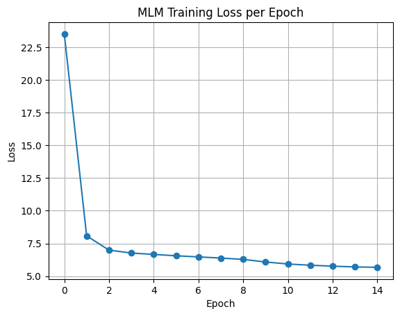
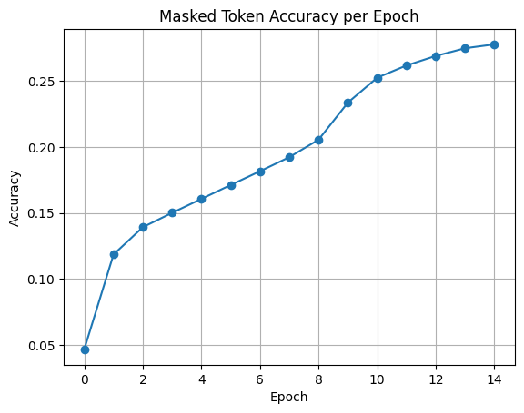
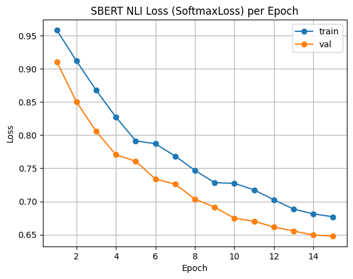
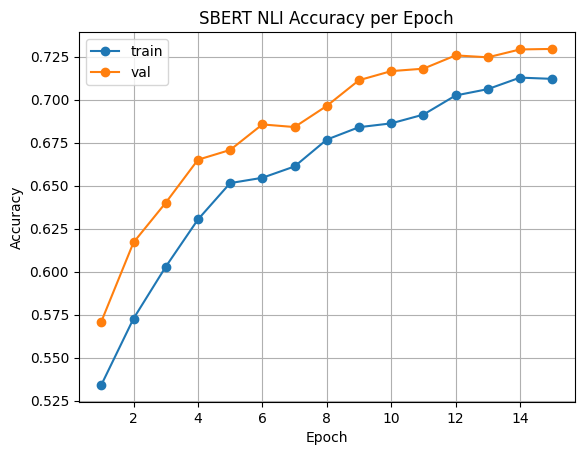
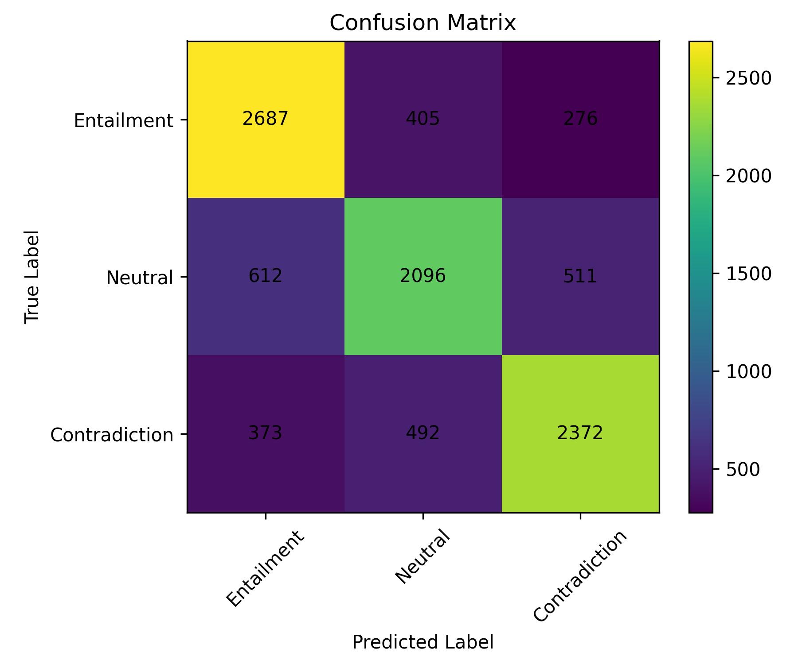

# A4 — Do You AGREE?

**Natural Language Understanding (NLU) — BERT → SBERT → Web App**

---

##  Overview

This project implements an **end-to-end semantic understanding pipeline**:

1. **Train BERT from scratch** using Masked Language Modeling (MLM) on a subset of Wikipedia.
2. **Convert BERT to Sentence-BERT (SBERT)** with a Siamese architecture for Natural Language Inference (NLI).
3. **Evaluate performance** using classification metrics on the SNLI dataset.
4. **Deploy a web application** that predicts semantic relationships between two sentences.


---

##  Architecture Pipeline

```
Wikipedia Corpus
      ↓
Masked Language Modeling (MLM)
      ↓
BERT Encoder (trained from scratch)
      ↓
Siamese SBERT + Softmax Loss (SNLI)
      ↓
NLI Prediction Web App
```

---

## Project Structure

```
A4/
│
├── a4.ipynb              
│
├── artifacts/
│   └── corpus_100k.txt        
│
├── tokenizer/
│   └── vocab.txt              
│
├── models/
│   ├── bert_scratch_mlm.pt
│   ├── bert_scratch_mlm_meta.json
│   ├── sbert_softmax_snli.pt
│   └── sbert_softmax_snli_meta.json
│
├── app/
│   ├── app.py                  # Flask server
│   ├── model_def.py            # SBERT loader + architecture
│   └── templates/
│       └── index.html          # Web UI
│
└── README.md
```

---

## Task 1 — Train BERT from Scratch

### Dataset

* **Wikipedia English subset (~100k samples)**
* Publicly available and properly cited.

### Method

* Custom **WordPiece tokenizer**
* Transformer **encoder-only architecture**
* **Masked Language Modeling (15% masking rule)**
* Optimizer: **AdamW + linear warmup + decay**


## Task 2 — Sentence-BERT for NLI

### Dataset

* **SNLI (Stanford Natural Language Inference)**

### Model

* **Siamese shared BERT encoder**
* **Mean pooling** → sentence embeddings
* Classification using:

```
(u, v, |u − v|) → Linear → Softmax
```

### Training

* Fine-tuning with **cross-entropy loss**
* Epoch-level logging of:

  * Train/validation loss
  * Train/validation accuracy

---

##  Training Curves

### Masked Language Model (MLM)

**Training Loss**


**Masked Token Accuracy**


---

### SBERT NLI Model

**Training Loss**


**Validation Accuracy**



## Task 3 — Evaluation & Analysis

### Confusion Matrix




### Classification Report

| Class | Precision | Recall | F1-Score | Support |
|-------|-----------|--------|----------|---------|
| Entailment | 0.7318 | 0.7978 | 0.7634 | 3368 |
| Neutral | 0.7003 | 0.6511 | 0.6748 | 3219 |
| Contradiction | 0.7509 | 0.7328 | 0.7417 | 3237 |
| **Accuracy** |  |  | **0.7283** | 9824 |
| **Macro Avg** | 0.7276 | 0.7272 | 0.7266 | 9824 |
| **Weighted Avg** | 0.7277 | 0.7283 | 0.7272 | 9824 |

### Metrics

* Accuracy
* Precision
* Recall
* F1-score
* Confusion matrix

### Observations

* Training from scratch with limited data results in:

  * Lower entailment recall
  * Class imbalance sensitivity
* Performance improves with:

  * Larger MLM corpus
  * More epochs
  * Larger hidden size / layers

---

##  Task 4 — Web Application

### Features

* Two input boxes:

  * **Premise**
  * **Hypothesis**
* Predicts:

  * Entailment
  * Neutral
  * Contradiction
* Displays **class probabilities**.

### Run Locally

```bash
cd A4
python app/app.py
```

Open in browser:

```
http://127.0.0.1:5000
```

---


##  Demo


---

**End of README**
