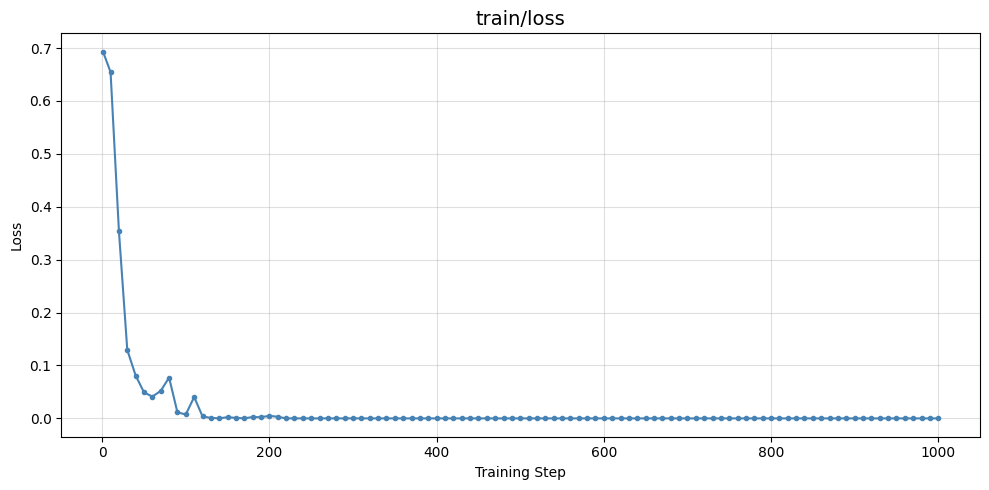

# NLP Assignment 5

## Optimization via Human Preference & LLM-as-a-Judge

This project demonstrates how to fine-tune a Large Language Model (LLM) using **Direct Preference Optimization (DPO)** to improve truthfulness and reduce hallucinations in generated responses.

The model is trained using a **human-preference dataset** containing pairs of correct and incorrect responses. The training process teaches the model to prefer truthful answers over hallucinated ones.

---

# Project Overview

Large Language Models sometimes produce **hallucinated or incorrect information**.
To address this, we use **preference learning**, where the model learns from examples of:

* **Chosen responses** → correct / factual answers
* **Rejected responses** → hallucinated or incorrect answers

Using **Direct Preference Optimization (DPO)**, the model is optimized to generate responses closer to the preferred outputs.

---

# Dataset

Dataset used:

`jondurbin/truthy-dpo-v0.1`

Hugging Face Link:
https://huggingface.co/datasets/jondurbin/truthy-dpo-v0.1

Each dataset example contains:

| Column   | Description                       |
| -------- | --------------------------------- |
| system   | Optional system instruction       |
| prompt   | User query                        |
| chosen   | Correct / truthful response       |
| rejected | Incorrect / hallucinated response |

For DPO training, only the following columns are used:

```
prompt
chosen
rejected
```

---

# Project Workflow

The assignment is divided into several tasks.

## Task 1 — Dataset Preparation

Steps performed:

1. Load dataset from Hugging Face.
2. Preprocess dataset:

   * Merge `system` prompt with `prompt` when available
   * Remove unnecessary whitespace
3. Keep only required columns:

   * `prompt`
   * `chosen`
   * `rejected`
4. Split dataset into:

   * Training set
   * Evaluation set

---

## Task 2 — Model Training using DPO

Base Model:

```
Qwen/Qwen2.5-1.5B-Instruct
```

Training is performed using **TRL's DPOTrainer**.

### Training Strategy

To reduce GPU memory usage:

```
model_ref = None
precompute_ref_log_probs = True
```

This means:

* The reference model runs once to compute log probabilities
* Log probabilities are cached
* Reference model is removed from memory

Only the main model remains in VRAM during training.

### Training Components

* Hugging Face Transformers
* TRL (Transformer Reinforcement Learning)
* DPOTrainer
* PyTorch
* Hugging Face Datasets

---

# Training Configuration

Example training parameters include:

* Learning Rate
* Batch Size
* Gradient Accumulation
* Evaluation Strategy
* Logging Steps

Training metrics and curves are monitored during training.



---

# Task 3 — Upload Model to Hugging Face

After training, the model is uploaded to Hugging Face Hub.


```
https://huggingface.co/samir246pokharel/LLM_Jugde
```

The following components are pushed:

* Trained model weights
* Tokenizer
* Model configuration

---
# Task 4 — LLM-as-a-Judge Evaluation

In this task, the outputs of two models were compared using an **LLM-as-a-Judge** evaluation method.

* **Model A:** Base Model (Original pretrained model)
* **Model B:** DPO Model (Fine-tuned using Direct Preference Optimization)

The judge model evaluated responses from both models and selected the better answer for each instruction.

---

## Final Results

```
============================================================
TASK 4 FINAL RESULTS
============================================================
Model B wins : 4
Ties         : 4
Total        : 15
Win Rate     : 40.00%
============================================================
```

---

## Detailed Evaluation Results

| Sample ID | Instruction                                                             | Winner  |
| --------- | ----------------------------------------------------------------------- | ------- |
| 1         | What are some good browser alternatives to Chrome?                      | Tie     |
| 2         | Hi, my sister and her girlfriends want me to plan something fun.        | Model A |
| 3         | Hi, I have some falafel, but no tahini to put on it.                    | Model A |
| 4         | Can you tell me how to make chocolate chip cookies?                     | Model A |
| 5         | How can I make bubble solution?                                         | Model B |
| 6         | How is oil turned into gasoline?                                        | Model B |
| 7         | How do I wrap a present neatly?                                         | Model B |
| 8         | What is some cool music from the 1920s?                                 | Model B |
| 9         | Hi, I'd like to play ice hockey. Can you explain the basics?            | Model A |
| 10        | Is the US border open to Canada?                                        | Model A |
| 11        | What are the names of some famous actors that started on stage?         | Tie     |
| 12        | Hi, I've decided to keep a rat as a pet. How do I care for it?          | Model A |
| 13        | I have my grandfather's antique fountain pen. How should I maintain it? | Tie     |
| 14        | What breed dog is the smallest?                                         | Model A |
| 15        | What is Kevlar made out of?                                             | Tie     |

---

## Summary

* **Model A (Base Model) Wins:** 7
* **Model B (DPO Model) Wins:** 4
* **Ties:** 4
* **Total Evaluations:** 15
* **Model B Win Rate:** **40%**

This evaluation compares the **base model** with the **DPO fine-tuned model**, demonstrating how preference optimization affects response quality.

# Project Structure

```
.
├── A5.ipynb            # Main assignment notebook
├── README.md           # Project documentation
└── requirements.txt    # Python dependencies (optional)
```

---

# Installation

Clone the repository:

```bash
git clone https://github.com/Samir4456/Natural-Language-Processing.git
cd Natural-Language-Processing
```

Install required packages:

```bash
pip install transformers
pip install datasets
pip install trl
pip install accelerate
pip install peft
```


# Key Concepts Demonstrated

* Preference Learning
* Direct Preference Optimization (DPO)
* Human feedback based training
* LLM hallucination reduction
* Hugging Face ecosystem
* Model deployment to Hugging Face Hub

---

# References

TRL Documentation
https://huggingface.co/docs/trl/main/dpo_trainer

Hugging Face Transformers
https://huggingface.co/docs/transformers

Dataset
https://huggingface.co/datasets/jondurbin/truthy-dpo-v0.1

